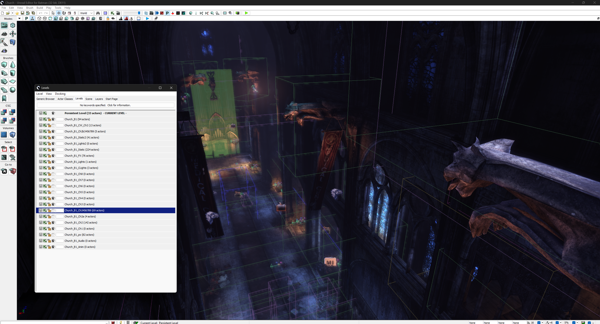

<h1 align="center">BmEditor</h1>

UnrealEd for Arkham City

 

  

 

UDK editor, modified to work with the game's own levels and packages. Supports out-of-the-box custom:
- Levels
- Materials
- Meshes
- Animations
- Scripts (UnrealScript)

## 🚀 Getting started

1. Download [the latest installer](../../releases/latest) and run it.
2. Pick your Arkham City folder. Steam and Epic installs are detected automatically.
3. Press **Install**, then launch the editor from the shortcut.

## 🦇 Before you start

This is largely the stock UE3 editor, so I'm not maintaining my own docs for this project. UDK guides and tutorials cover almost everything you'll want to do, and that's what most people learn from.

Expect bugs/crashes. It's the UDK editor which was only ever so stable to begin with, and not everything has been tested for the AC support. I'll fix bugs as reports come in, but I've only got so much time to work on it - I'd recommend saving often.

If you like the project, I share progress updates on the [Arkham Workshop](https://discord.com/invite/arkhamworkshop) Discord server! And if you're interested in gameplay mods, check out my other project [BmSDK](https://bmsdk.dev/) for both Arkham City and Knight.